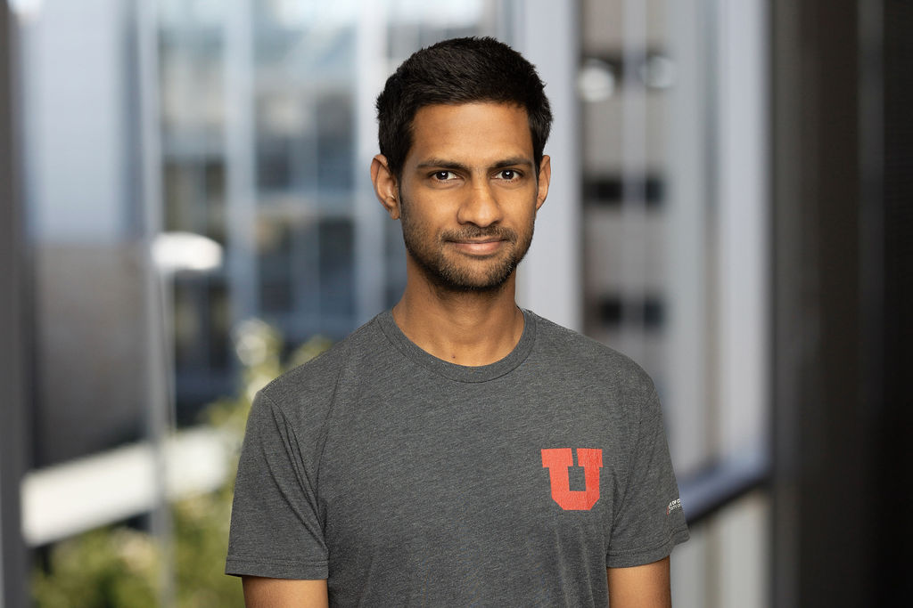

# Contact Info
**E-mail**: milinda (at) oden (dot) utexas (dot) edu  
**Office**: 
POB 5.232,
Oden Institute, University of Texas at Austin, TX 78752 

You can find my CV (last updated Dec. 2025) [here](CV_Fernando.pdf), link to my Google Scholar [profile](https://scholar.google.com/citations?user=PPKkq2cAAAAJ&hl=en) 

# News
- I will be joining the Department of Scientific Computing at Florida State University as an Assistant Professor in Fall 2026. 
- I will be presenting [my work](https://meetings.siam.org/sess/dsp_programsess.cfm?SESSIONCODE=87056) at SIAM PP'26 in Berlin.

# Opportunities
I am currently seeking a motivated and dedicated PhD student to begin in Fall 2026 in the Computational Science program. Interested applicants are encouraged to apply through the program’s application [portal](
https://www.sc.fsu.edu/graduate/application).

I am particularly looking for students with a strong background in high-performance computing and strong programming skills. Experience in the design and implementation of parallel algorithms for hardware accelerators (e.g., GPUs) would be a significant advantage.  In addition to submitting a formal application, interested students are welcome to email me directly with:
* A CV
* List of courses taken
* A brief statement describing their experience in HPC
* A summary of relevant projects and any publications (if available, though not required)
 

# Research
My research is focused on developing scalable algorithms for the numerical solution of partial differential equations (PDEs) on modern supercomputers. Examples of systems I have worked on include the Einstein field equations for gravitational wave propagation, the electron Boltzmann transport equation, low-temperature plasma flows, and moving interface transport problems. My interests are in developing state-of-the-art methods that synthesize numerical and parallel algorithms, high-performance computing (HPC), and their integration with scientific machine learning methods. 

## A fast solver for the electron Boltzmann transport equation:
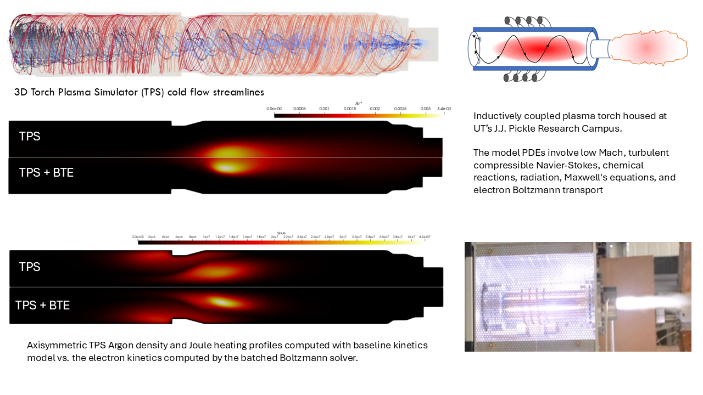
Low-temperature plasmas (LTPs) find applications in advanced manufacturing, semiconductor processing, and many other application domains. Modeling LTPs can be challenging due to the non-equilibrium chemistry, multiple time scales, and the non-local coupling effects. A key component in LTP simulation is the transport of electrons and its coupling to the ionized and neutral species. The BTE provides an accurate kinetic description of electron transport and tracks the electron distribution function (EDF). This function is defined in a seven-dimensional space that consists of space, velocity, and time.  

**Spatially homogeneous BTE**: I developed a Galerkin scheme to solve the spatially homogeneous electron BTE with an Eulerian formulation. This algorithm extends the state-of-the-art ``two-term'' expansion for a multi-term expansion with support for electron-heavy collisions and electron-electron Coulomb interactions. The velocity-space EDF is represented using B-splines in speed and spherical harmonics in angular coordinates. I worked on developing fast, robust numerical schemes to compute direct steady-state and transient solutions with implicit time integration.

**Coupling BTE solvers to plasma flows**: I developed a batched BTE algorithm that can be coupled with existing fluid-based LTP codes. My solver enables the kinetic treatment of electrons for existing fluid-based plasma codes. This capability is demonstrated by modeling an inductively coupled plasma (ICP) torch. In the ICP torch, the EDF at a given spatial location will depend on the corresponding plasma parameters, such as gas temperature, ionization degree, species mole fractions, and the local electric field. It has been the long view that the BTE is too expensive to be used in LTP production runs. The designed algorithms to perform 1). Fast implicit BTE time integration, 2). Nearest neighbor interpolation for the input parameter space, and 3). Performance portable GPU acceleration *has reduced the cost of the batched BTE timestep with 512 velocity-space unknowns per grid point to just 2$\times$ of a fluid explicit timestep cost.*

## Extreme Scale Inverse problems 
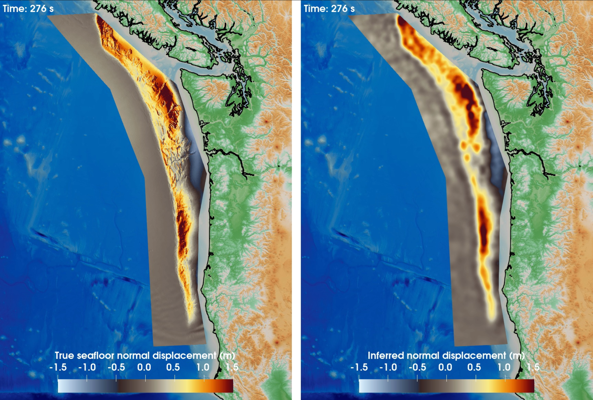
Adjoint-based matrix-free Newton-Krylov methods have been the state-of-the-art approach for solving PDE-governed inverse problems. These methods require a pair of forward and adjoint PDE solves per iteration, making them computationally expensive. While these methods generalize for a wide range of inverse problems,
for some problems, we can exploit the underlying problem structure to design fast algorithms. For inverse problems governed by linear autonomous dynamical systems, the parameter-to-observable operator is a block triangular Toeplitz matrix. We can design fast Hessian matrix-vector products based on the fact that the discrete Fourier transform diagonalizes circulant matrices. The fast Fourier transform (FFT) based Hessian matrix-vector product scales linearly in the unknowns, compared to a quadratic dense matrix-
vector products. This algorithmic innovation has enabled real-time extreme-scale Bayesian inference for Tsunami early warning, which involves $10^9$ parameters. The use of a GPU-accelerated FFT-based Hessian matrix-vector action algorithm has solved this problem involving $O(10^9)$ parameters under 0.4s using the World’s fastest supercomputer, El Capitan. **This project has won the prestigious 2025 ACM Gordon Bell award**.

## Numerical Relativity

  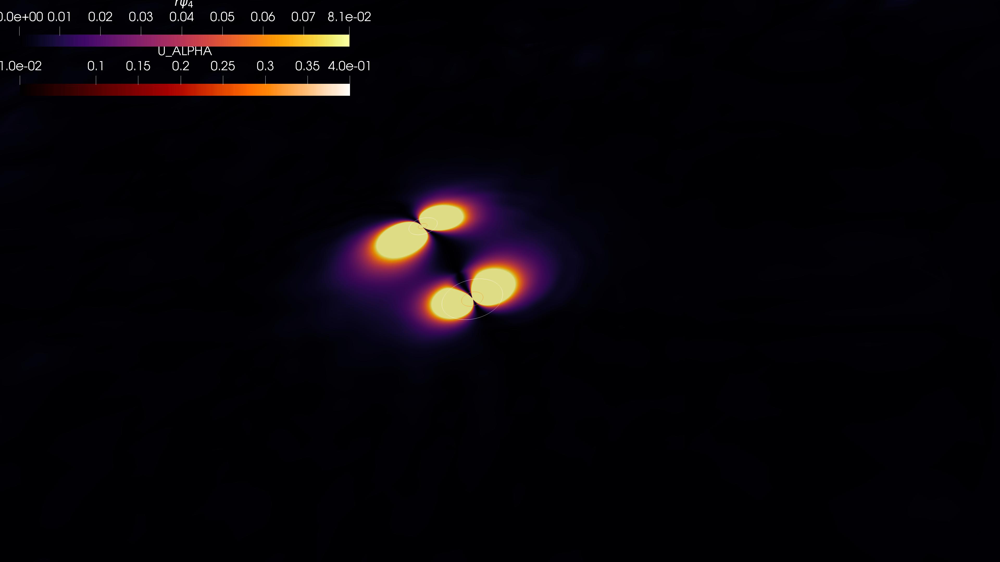
  <!-- 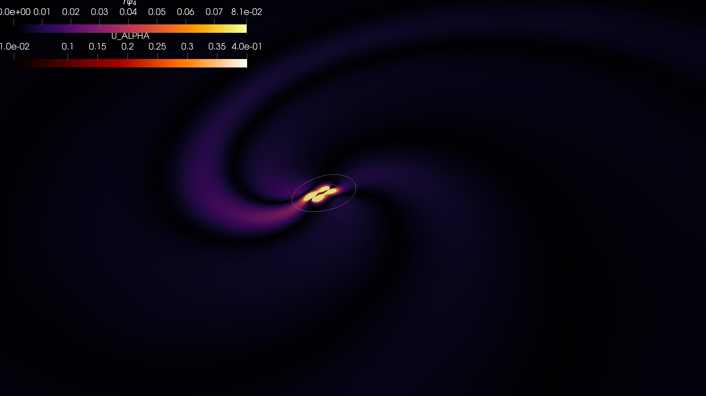 -->
  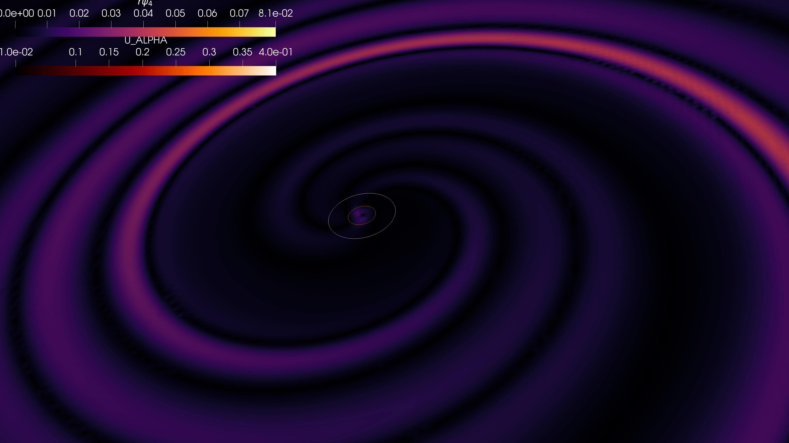

Numerically simulated GW forms are essential for analyzing and verifying detected GW events. Existing general relativity (GR) GW signal catalogs lack waveforms for large mass ratio (i.e., $m_2\geq m_1$ and $m_2/m_1 = q \geq 10$) binaries and have become a significant impediment for the future ground-based and space-based detectors such as LISA. The state-of-the-art numerical relativity codes demonstrate poor scalability on modern heterogeneous architectures. They also use discretization methods that over-refine and lack GPU acceleration, leading to computationally prohibitive costs for high mass ratio binary black hole mergers. **Scalable AMR algorithms**: I have developed massively parallel, GPU-accelerated, and portable spacetime adaptive data structures and algorithms to perform fast GR simulations. These algorithms are available in [Dendro-GR](https://github.com/paralab/Dendro-GR), an open-source library developed by my collaborators and me. *The novel algorithmic contributions have reduced the overall time-to-solution 6$\times$ or more compared to existing methods and enabled the computation of GWs for large mass-ratio binaries*. **Domain partitioning**: An effective domain partitioning scheme should ensure load-balancing while minimizing the data movement to enable scaling to thousands of computer nodes. I developed a fast octree partitioning algorithm that optimally partitions data across processes to minimize energy consumption and communication. This algorithm has been used in several other applications. **Wavelet-based AMR (WAMR)**: I introduced a novel AMR scheme informed by wavelet-based sparse representations. WAMR automatically captures the evolving features of the solution through wavelet coefficients. This has enabled us to resolve the evolving dynamics of black hole merger spacetimes while achieving the same accuracy with fewer grid points compared to the state-of-the-art fixed box-in-box grid refinement.
**Performance portable code generation**: The ``3 + 1''splitting of Einstein field equations consists of very complex hyperbolic PDEs that involve twenty-four unknowns per grid point and terms that include Christoffel symbols and spacetime Ricci curvature tensor. To efficiently evaluate these terms, I developed a symbolic code generation framework that abstracts the computation as a directed acyclic graph (DAG). I used common sub-expression elimination to reduce the overall cost of the operations and to discover a particular traversal order of the computational graph to minimize register spilling. **Spacetime adaptivity** For explicit time integration schemes, the global timestep size is constrained by the smallest grid spacing. In non-uniform explicit time marching schemes, the timestep size is locally defined based on local spatial resolution. The computational cost savings with time adaptivity can be significant, especially for large-mass-ratio binary mergers. To enable such computational savings, I developed parallel algorithms to perform local time-stepping for explicit time marching schemes on octrees.

## Extreme-scale AMR in modern supercomputers
The developed AMR algorithms are not limited to computational relativity. *These algorithms have enabled massively parallel AMR simulations in various computational fluid dynamics applications*. 

  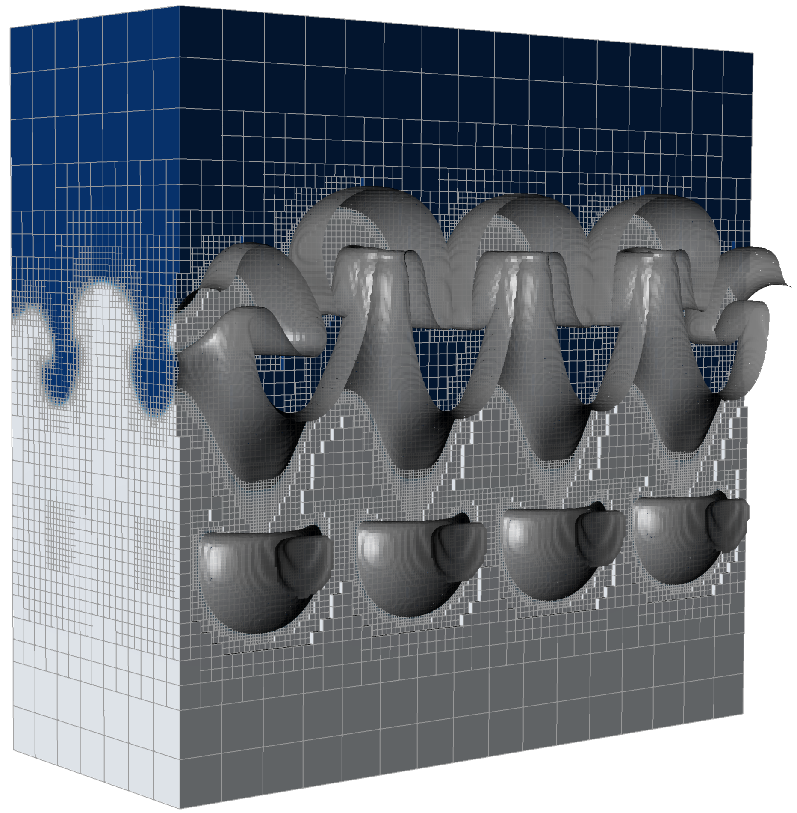
  <!-- 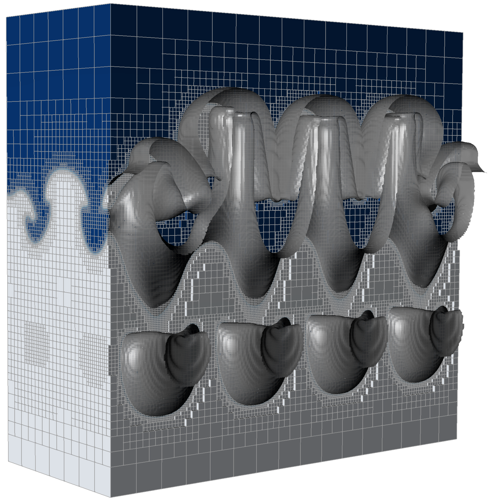 -->
  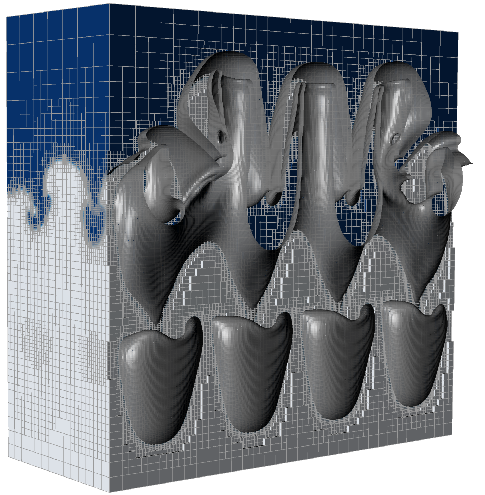

**Parallel-in-time through spacetime discretization** I worked on developing parallel algorithms for kd-tree-based adaptive $4D$ spacetime discretization methods for solving PDEs. Such spacetime discretization methods naturally allow adaptivity and parallelism in the time dimension.

  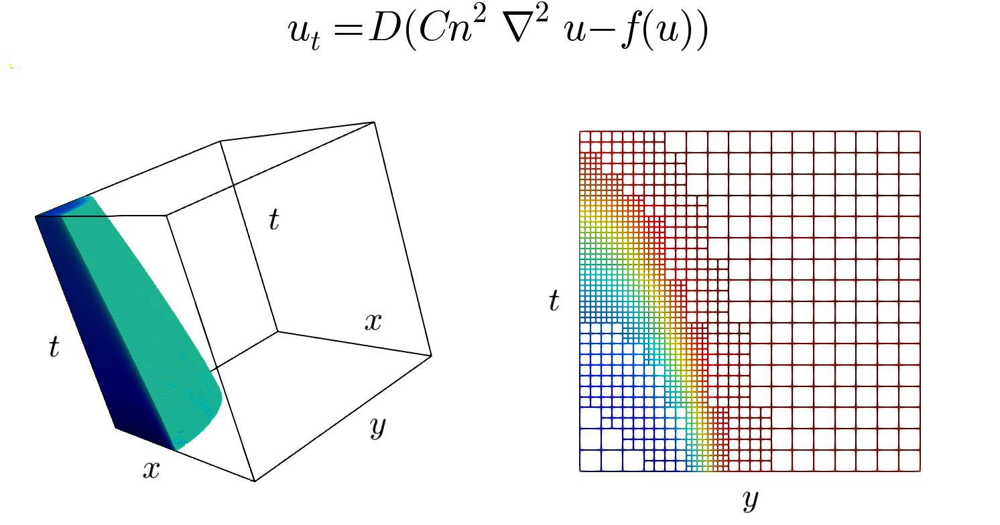
  <!-- 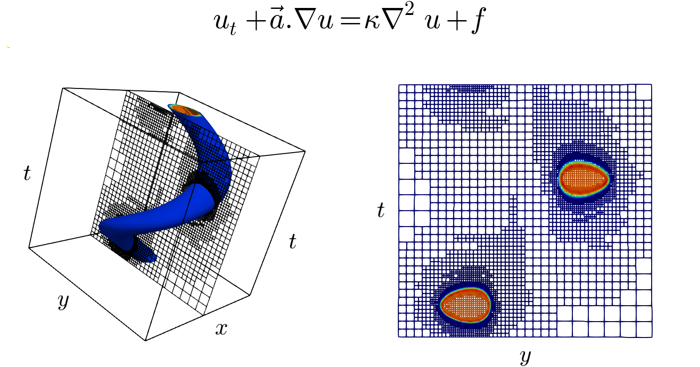 -->
  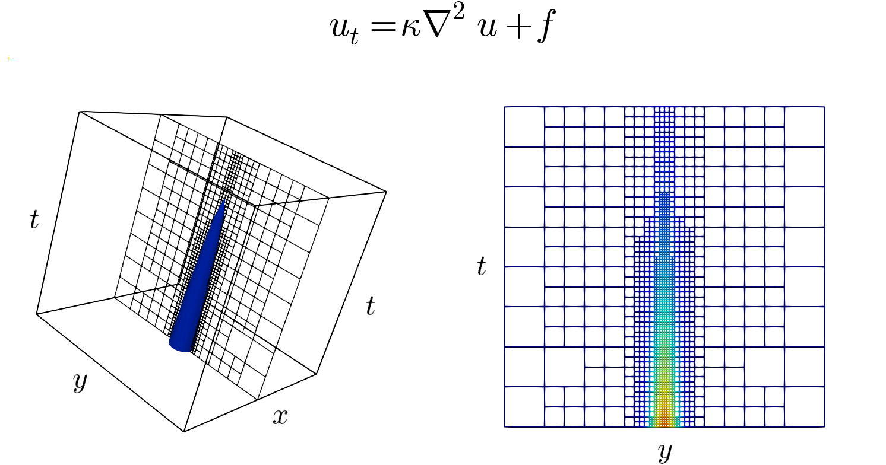

# Biography
Dr. Fernando received his Ph.D. in 2021 from the School of Computing at the University of Utah. He earned his Bachelor’s degree in Computer Science and Engineering from the University of Moratuwa.

His research focuses on developing advanced numerical methods and computationally optimal parallel algorithms for solving large-scale problems in science and engineering. His work has contributed to applications in computational relativity, plasma physics, and geophysics, resulting in state-of-the-art distributed-memory algorithms within the spacetime adaptive mesh refinement (AMR) framework Dendro, supporting applications in numerical relativity (Dendro-GR) and computational fluid dynamics.

He will be joining the Department of Scientific Computing, Florida State University as an Assistant Professor. His current research includes the development of fast algorithms for Boltzmann transport with applications to low-temperature plasma physics.

**Last Updated: Feb. 2026**

