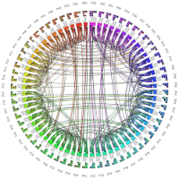
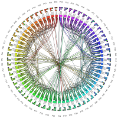

### Computational Relativity

<a href="https://github.com/paralab/Dendro-GR" target="_blank">Dendro-GR</a> : Massivly parallel computational framework for computational general relativity (<a href="https://arxiv.org/abs/1807.06128" target="_blank">arXiv:1807.06128v1</a>). 

<video width="400" height="225" controls loop>
   <source src="./vids/r1_U_CHI.mp4" type="video/mp4">
   Your browser does not support the video tag.
  </video>
  
  ```
  Equal mass ratio binary compact merger, slice over the octree of BSSN variable chi variable
  ```

   <video width="400" height="225" controls loop>
   <source src="./vids/r1_chi.mp4" type="video/mp4">
   Your browser does not support the video tag.
   </video>
   
   ```
   Equal mass ratio binary compact merger, slice over the octree of BSSN variable chi variable  
   with refinement. 
   ```

### Non-Linear Sigma Model

Simple non-linear wave equation solved by Dendro-GR to demonstrate the Wavelet Adaptive Mesh Refinement (WAMR)

<video width="520" height="280" controls loop>
 <source src="./vids/lwaveEq.mp4" type="video/mp4">
 Your browser does not support the video tag.
</video>

```
Linear wave equation solved using RK4 time stepper using Dendro-GR. Note how the refinement captures  
the propergation of the wave. 
```


<video width="463" height="225" controls loop>
 <source src="./vids/nlsmB.mp4" type="video/mp4">
 Your browser does not support the video tag.
</video>

```
Non linear wave equation with two Gaussian distributions as the initial condition.
```

### Space Filling Curve based octree partitioning. 

Hilbert curve based octree partitioning


Morton curve based octree partitioning


